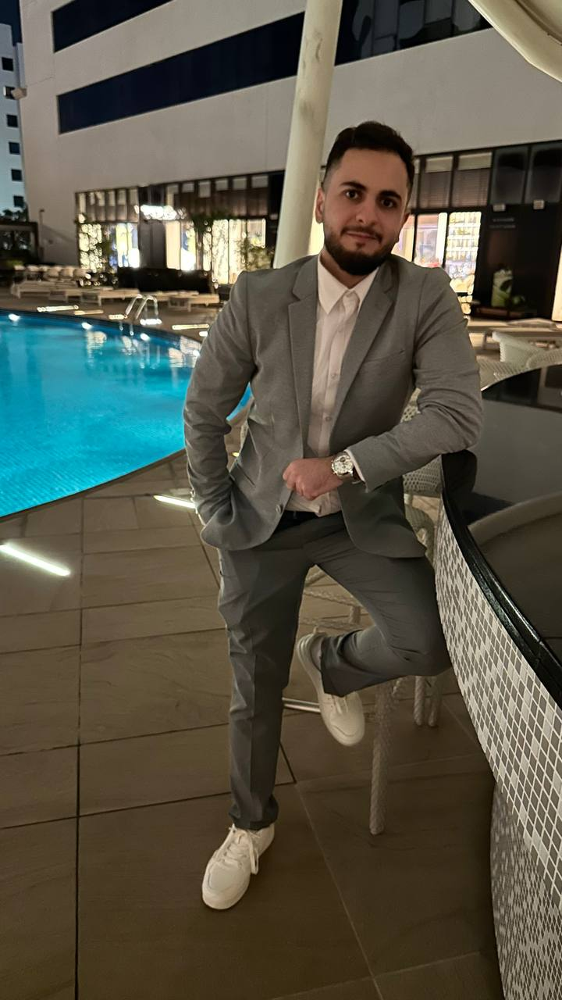

<!DOCTYPE html>
<html lang="en">
<head>
    <meta charset="UTF-8">
    <meta name="viewport" content="width=device-width, initial-scale=1.0">
    <title>Portfolio | Abdelqader Al-Salem</title>
    <link rel="icon" type="image/png" href="a-FAVICON.png">
    <link rel="apple-touch-icon" href="a-FAVICON.png">
    <link href="https://fonts.googleapis.com/css2?family=Poppins:wght@300;400;500;600;700;800&family=Playfair+Display:wght@700;800;900&display=swap" rel="stylesheet">
    
</head>
<body>

<header>
  <nav>
    <a href="#home" class="logo">Abdelqader .</a>
    <ul>
      <li><a href="#home">Home</a></li>
      <li><a href="#about">About</a></li>
      <li><a href="#skills">Skills</a></li>
      <li><a href="#projects">Projects</a></li>
      <li><a href="#experience">Experience</a></li>
      <li><a href="#contact">Contact</a></li>
    </ul>
  </nav>
</header>

<!-- HERO -->
<section id="home">
  

    

      

        
Software Engineer &amp; AI Specialist

        <h1 class="hero-name">Abdelqader Al-Salem</h1>
        
Building intelligent products · AI + Full-Stack

        
I build end-to-end digital products — from pixel-perfect React frontends to robust Node.js backends — with a strong focus on LLM integration and prompt engineering. Co-founder of <b style="color:var(--cyan)">Dardeshly</b>, an AI-powered WhatsApp marketing platform.

        

          <a href="mailto:abdelalsalem09@gmail.com" class="btn btn-primary">✉ Send Email</a>
          <a href="#projects" class="btn btn-outline">View My Work</a>
        

        

          <a href="https://wa.me/905521511094" target="_blank" class="social-pill">💬 WhatsApp</a>
          <a href="https://property-byabdel.vercel.app/" target="_blank" class="social-pill">🌐 Portfolio</a>
          <a href="https://dardeshly.com" target="_blank" class="social-pill">🚀 Dardeshly</a>
        

      

      

        

          
        

        
Opento Collaborate

      

    

  

</section>

<!-- ABOUT -->
<section id="about">
  

    

      
Get to know me

      <h2 class="section-title">About Me</h2>
    

    

      

        
I'm a <b>full-stack software engineer</b> based in Istanbul, Turkey, passionate about building scalable web applications and AI-powered products. My stack spans React frontends to Node.js backends, REST APIs, and database design.

        
As <b>co-founder of Dardeshly</b>, I lead product and engineering direction — designing intelligent prompt pipelines, integrating cutting-edge LLMs (Claude, GPT, DeepSeek, Grok), and shipping complete solutions end-to-end.

        
I combine technical depth with real-world <b>business acumen</b> built through sales experience, which sharpens my ability to understand customer needs and translate them into impactful shipped code.

      

      

        <h3 style="color:var(--text);font-size:1.05rem;font-weight:700;margin-bottom:1.5rem;">Core Expertise</h3>
        

          
<h4>AI Engineering</h4>
Prompt design, LLM integration, RAG systems and AI-powered product features

          
<h4>Full Stack</h4>
React, Next.js, Node.js, REST APIs, PostgreSQL & MongoDB end-to-end

          
<h4>Product Thinking</h4>
Translating customer needs into requirements and shipping features that matter

          
<h4>Communication</h4>
Sales background brings negotiation, client management &amp; pitch skills

        

      

    

  

</section>

<!-- SKILLS -->
<section id="skills">
  

    

      
What I work with

      <h2 class="section-title">Technical Skills</h2>
    

    

      
<h3>🤖 AI &amp; LLMs</h3><ul class="skill-list"><li>Prompt Engineering</li><li>Claude &amp; OpenAI APIs</li><li>DeepSeek, Grok, Sora</li><li>RAG Systems</li><li>AI-Powered Chatbots</li><li>Anthropic SDK</li></ul>

      
<h3>⚛️ Frontend</h3><ul class="skill-list"><li>React.js &amp; Next.js</li><li>JavaScript (ES6+)</li><li>HTML5 &amp; CSS3</li><li>Tailwind CSS</li><li>Responsive Design</li><li>Performance Opt.</li></ul>

      
<h3>⚙️ Backend</h3><ul class="skill-list"><li>Node.js &amp; Express</li><li>REST APIs</li><li>WebSockets</li><li>PostgreSQL</li><li>MongoDB</li><li>Auth &amp; Security</li></ul>

      
<h3>🛠 Tools</h3><ul class="skill-list"><li>Git &amp; GitHub</li><li>VS Code</li><li>Agile / Scrum</li><li>Vite &amp; npm</li><li>Postman</li><li>Deployment</li></ul>

      
<h3>🤝 Soft Skills</h3><ul class="skill-list"><li>Problem Solving</li><li>Client Communication</li><li>Sales &amp; Negotiation</li><li>Team Collaboration</li><li>Time Management</li><li>End-to-End Ownership</li></ul>

      
<h3>🌐 Languages</h3><ul class="skill-list"><li>Arabic — Native</li><li>English — Advanced</li><li>Turkish — Beginner</li></ul>

      
<h3>🛂 Passport</h3><ul class="skill-list"><li>Türkiye</li><li>Jordan</li></ul>

    

  

</section>

<!-- PROJECTS -->
<section id="projects">
  

    

      
What I've built

      <h2 class="section-title">Featured Projects</h2>
    

    

      

        

01 — Featured

Dardeshly

WhatsApp Marketing Platform

        

Co-founded Dardeshly — an AI-powered WhatsApp marketing platform that sends personalized promotions to thousands of customers automatically. Built for restaurants, real estate agents, and e-commerce teams.

        
Claude APIReact.jsNode.jsLLM PipelinesWhatsApp API

        <a href="https://dardeshly.com" target="_blank" class="proj-link">Visit Platform →</a>

      

      

        

02 — AI

AI Integration Suite

LLM-Powered Applications

        

Multiple AI-powered applications built with prompt engineering, intelligent chatbots, and automation. Expertise in integrating Claude, GPT, and DeepSeek with custom business logic for reliable, on-brand responses.

        
Prompt Eng.RAGAutomationAnthropic API

        <a href="mailto:abdelalsalem09@gmail.com" class="proj-link">Get in touch →</a>

      

      

        

03 — Web

E-Commerce Platform

Full-Stack Web App

        

Developed responsive e-commerce product pages with dynamic JavaScript, cart management, and interactive shopping features. Focused on performance, cross-browser compatibility, and user experience.

        
ReactJavaScriptCSS3Responsive

        <a href="mailto:abdelalsalem09@gmail.com" class="proj-link">View Details →</a>

      

    

    

      

3+

Years Experience

      

10+

Projects Shipped

      

1

Active Startup

    

  

</section>

<!-- EXPERIENCE -->
<section id="experience">
  

    

      
My journey

      <h2 class="section-title">Work Experience</h2>
    

    

      

        

        
2026 — Present

        
Co-Founder &amp; Software Engineer

        
Dardeshly · dardeshly.com

        
Co-founded Dardeshly, an AI-powered WhatsApp marketing platform. Lead all product and engineering decisions from ideation to production deployment.

        <ul class="exp-points">
          <li>Designed prompt pipelines for reliable, on-brand LLM responses</li>
          <li>Integrated Claude, GPT, DeepSeek, and Grok APIs</li>
          <li>Built full-stack platform with React.js frontend and Node.js backend</li>
          <li>Managed end-to-end product lifecycle including deployment</li>
        </ul>
      

      

        

        
2025

        
Real Estate Sales Consultant

        
Real Estate Company · Istanbul

        
High-performance sales role advising clients on property investments, developing skills directly transferable to tech product work.

        <ul class="exp-points">
          <li>Closed multiple property transactions through relationship building</li>
          <li>Developed client communication and negotiation expertise</li>
          <li>Learned to translate customer needs into clear requirements</li>
        </ul>
      

      

        

        
Jun 2024 — Sep 2024

        
Front-End Developer Intern

        
Futeric · Amman, Jordan

        
Developed and maintained responsive web interfaces in a professional agile environment.

        <ul class="exp-points">
          <li>Built responsive UIs with React.js</li>
          <li>Improved website performance and cross-browser compatibility</li>
          <li>Participated in Agile ceremonies and sprint reviews</li>
        </ul>
      

    

  

</section>

<!-- CONTACT -->
<section id="contact">
  

    

      
Let's connect

      <h2 class="section-title">Get In Touch</h2>
    

    

      
I'm always open to new projects, collaboration opportunities, and interesting conversations. Whether you want to build something together or just say hi — reach out!

      

        <a href="mailto:abdelalsalem09@gmail.com" class="c-card">✉ Email
abdelalsalem09@gmail.com
</a>
        <a href="tel:+905521511094" class="c-card">📱 Phone
+90 552 151 10 94
</a>
      

      

        <a href="mailto:abdelalsalem09@gmail.com" class="btn btn-primary" style="font-size:1rem;padding:1rem 2.5rem">✉ Send Me an Email</a>
      

    

  

</section>

<footer>
  

    
© 2026 Abdelqader Al-Salem · All rights reserved

    <ul class="footer-nav">
      <li><a href="#home">Home</a></li>
      <li><a href="#about">About</a></li>
      <li><a href="#projects">Projects</a></li>
      <li><a href="#contact">Contact</a></li>
    </ul>
  

</footer>

</body>
</html>
